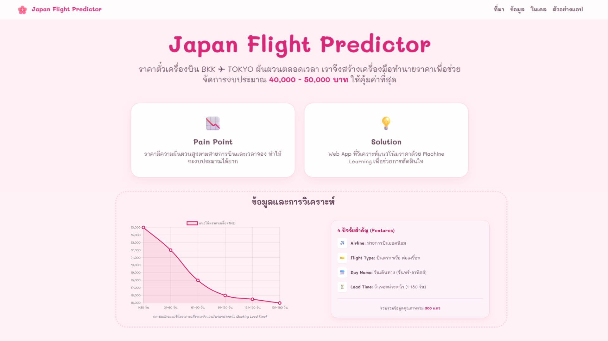

# 🌸 Japan Flight Predictor 🎌

**Japan Flight Predictor** คือเว็บแอปพลิเคชันที่นำระบบ **Machine Learning** มาช่วยคาดการณ์ราคาตั๋วเครื่องบินจากกรุงเทพฯ ไปยังโตเกียว แอปนี้ถูกออกแบบมาเพื่อช่วยให้นักเดินทางวางแผนงบประมาณได้แม่นยำขึ้น

---
### 🔗 Live Demo

<div align="center">
  <a href="https://miyomui-flight-price-prediction.streamlit.app/" target="_blank" rel="noopener noreferrer">
    
  </a>
</div>


## ✨ Features
* **AI-Powered Prediction:** ใช้โมเดล Machine Learning ในการประมวลผลข้อมูลสายการบิน รูปแบบการบิน และระยะเวลาจองล่วงหน้าเพื่อทำนายราคา
* **Cute & Premium Design:** ธีมสีชมพูพาสเทล และฟอนต์ 'Mali' ที่ดูเป็นมิตรและอ่านง่าย
* **Interactive Visuals:** 
    * แสดงผลลัพธ์ในรูปแบบ **Boarding Pass** ที่ออกแบบมาอย่างสมจริง
    * มีเอฟเฟกต์ลูกโป่ง (Balloons) เฉลิมฉลองเมื่อคำนวณราคาเสร็จ

## 🤖 Machine Learning Model Training




## 🛠️ Tech Stack
* **Language:** Python
* **Web Framework:** [Streamlit](https://streamlit.io/)
* **Libraries:** Pandas, NumPy, Scikit-Learn
* **Model Deployment:** Joblib (สำหรับโหลดโมเดล .pkl)


## 📂 Project Structure
```text
.
├── data/                       # โฟลเดอร์เก็บข้อมูล
│   └── bkk_tokyo_flight_prices.csv
├── images/                     # โฟลเดอร์เก็บรูปภาพประกอบใน README และ App
├── models/                     # โฟลเดอร์เก็บโมเดลที่เทรนเสร็จแล้ว (.pkl)
│   ├── flight_price_model.pkl
│   └── model_columns.pkl
├── notebooks/                  # โฟลเดอร์เก็บไฟล์ Jupyter Notebook สำหรับการวิเคราะห์
│   └── 01_data_analysis_and_training.ipynb
├── src/                        # โฟลเดอร์เก็บ Source Code หลัก
│   ├── app.py                  # ไฟล์หลักสำหรับรัน Streamlit Web App
│   └── info.html               # ไฟล์ HTML infographic
├── README.md                   # ไฟล์อธิบายรายละเอียดโปรเจกต์
└── requirements.txt            # ไฟล์ระบุ Library ที่ต้องใช้ในการรันโปรเจกต์
```


## 🚀 Getting Started

1.  **Clone the repository:**
    ```bash
    git clone https://github.com/miyomui/Mini-ProjectAIE322-Flight-Price-Prediction.git
    ```

2.  **Install dependencies:**
    ```bash
    pip install -r requirements.txt
    ```

3.  **Run the application:**
    ```bash
    streamlit run src/app.py
    ```


## 💖 Credits
โปรเจกต์นี้เป็นส่วนหนึ่งของวิชา **AIE322 - Supervised Machine Learning** (Mini Project) พัฒนาโดย **ลลิตวดี วงศ์คูณ**
