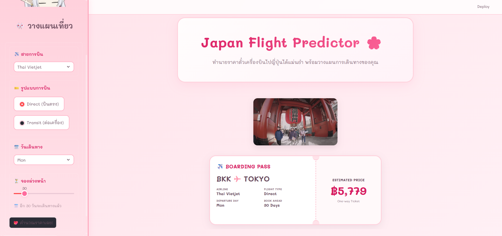

# 🌸 Japan Flight Predictor 🎌

**Japan Flight Predictor** คือเว็บแอปพลิเคชันที่นำระบบ **Machine Learning** มาช่วยคาดการณ์ราคาตั๋วเครื่องบินจากกรุงเทพฯ ไปยังโตเกียว แอปนี้ถูกออกแบบมาเพื่อช่วยให้นักเดินทางวางแผนงบประมาณได้แม่นยำขึ้น

---
### 🔗 Live Demo


สามารถลองใช้งานแอปพลิเคชันตัวจริงได้ที่นี่เลยค่ะ  
👉 **[https://miyomui-flight-price-prediction.streamlit.app/](https://miyomui-flight-price-prediction.streamlit.app/)**


## ✨ Features
* **AI-Powered Prediction:** ใช้โมเดล Machine Learning ในการประมวลผลข้อมูลสายการบิน รูปแบบการบิน และระยะเวลาจองล่วงหน้าเพื่อทำนายราคา
* **Cute & Premium Design:** ธีมสีชมพูพาสเทล และฟอนต์ 'Mali' ที่ดูเป็นมิตรและอ่านง่าย
* **Interactive Visuals:** 
    * แสดงผลลัพธ์ในรูปแบบ **Boarding Pass** ที่ออกแบบมาอย่างสมจริง
    * มีเอฟเฟกต์ลูกโป่ง (Balloons) เฉลิมฉลองเมื่อคำนวณราคาเสร็จ


## 🛠️ Tech Stack
* **Language:** Python
* **Web Framework:** [Streamlit](https://streamlit.io/)
* **Libraries:** Pandas, NumPy, Scikit-Learn
* **Model Deployment:** Joblib (สำหรับโหลดโมเดล .pkl)


## 📂 Project Structure
* 📁 `data/`: เก็บชุดข้อมูลหลักที่ใช้ในการวิเคราะห์และทำนายราคา (`bkk_tokyo_flight_prices.csv`)
* 📁 `images/`: เก็บไฟล์ภาพนิ่งที่ใช้ประกอบในแอปพลิเคชันหรือเอกสาร (`pass.png`)
* 📁 `models/`: เก็บโมเดล Machine Learning ที่ฝึกสอนเสร็จแล้วในรูปแบบไฟล์ `.pkl` และรายชื่อคอลัมน์ที่เกี่ยวข้อง
* 📁 `notebooks/`: เก็บไฟล์ Jupyter Notebook (`01_data_analysis_and_training.ipynb`) ที่ใช้สำหรับขั้นตอนการสำรวจข้อมูล (EDA) และการเทรนโมเดล
* 📁 `src/`: โฟลเดอร์เก็บซอร์สโค้ดหลักสำหรับรันหน้าเว็บแอปพลิเคชัน (`app.py`)
* 📄 `README.md`: ไฟล์เอกสารอธิบายรายละเอียดและวิธีใช้งานโปรเจกต์
* 📄 `requirements.txt`: ไฟล์ระบุรายการ Library และ Version ที่จำเป็นต้องใช้ในการรันแอป


## 🚀 Getting Started

1.  **Clone the repository:**
    ```bash
    git clone https://github.com/miyomui/Mini-ProjectAIE322-Flight-Price-Prediction.git
    ```

2.  **Install dependencies:**
    ```bash
    pip install -r requirements.txt
    ```

3.  **Run the application:**
    ```bash
    streamlit run src/app.py
    ```


## 💖 Credits
โปรเจกต์นี้เป็นส่วนหนึ่งของวิชา **AIE322** (Mini-Project) พัฒนาโดย **ลลิตวดี วงศ์คูณ**